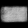

# VAE Latent Space Interpolation for FashionMNIST

This project demonstrates the use of a Variational Autoencoder (VAE) to interpolate between different latent space representations of images from the FashionMNIST dataset. The goal is to visually observe how two different types of fashion items transition between each other through the latent space.

## Project Structure

- **`main.py`**: The main script to generate the interpolations between images from the FashionMNIST dataset and save them as GIFs.
- **`Net.py`**: Contains the definition of the VAE model, including the encoder and decoder architecture.
- **`model.pth`**: The trained VAE model.
- **GIFs**: The following GIFs were generated by interpolating between two images:
  - `transform_from_Ankle boot_to_Trouser.gif`
  - `transform_from_Bag_to_Pullover.gif`
  - `transform_from_T-shirt-top_to_Pullover.gif`

## Usage

1. **Load the Model**: The `model.pth` file is a pre-trained VAE model that you can use for generating interpolations between images in the FashionMNIST dataset.
2. **Generate Interpolations**: The `main.py` script contains code to interpolate between two images in the latent space and generate a smooth transition GIF between them.

### Example GIFs

Below are examples of GIFs generated by the model, showing the transformation between different clothing items:

#### T-shirt/top to Pullover


#### Bag to Pullover


#### Ankle boot to Trouser


## Requirements

- Python 3.x
- PyTorch
- torchvision
- numpy
- pillow
- imageio

You can install the required dependencies using:

```bash
pip install torch torchvision numpy pillow imageio
